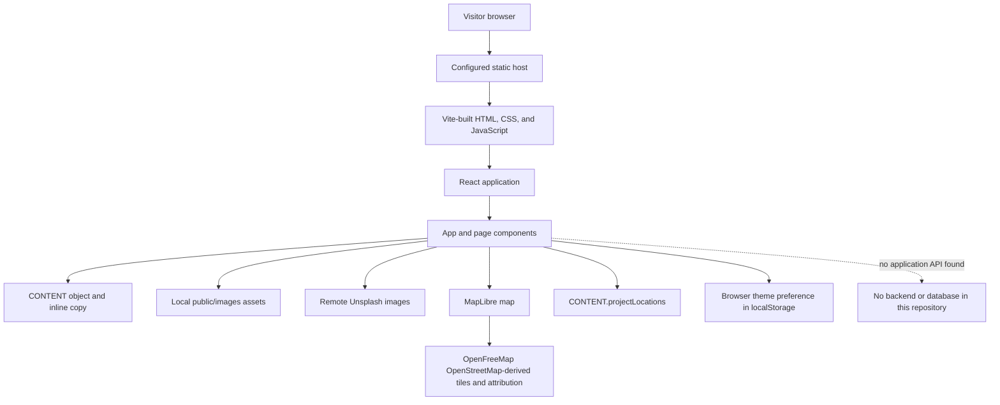
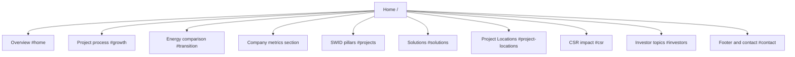
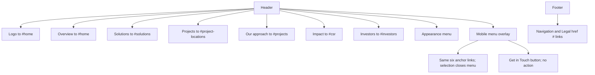
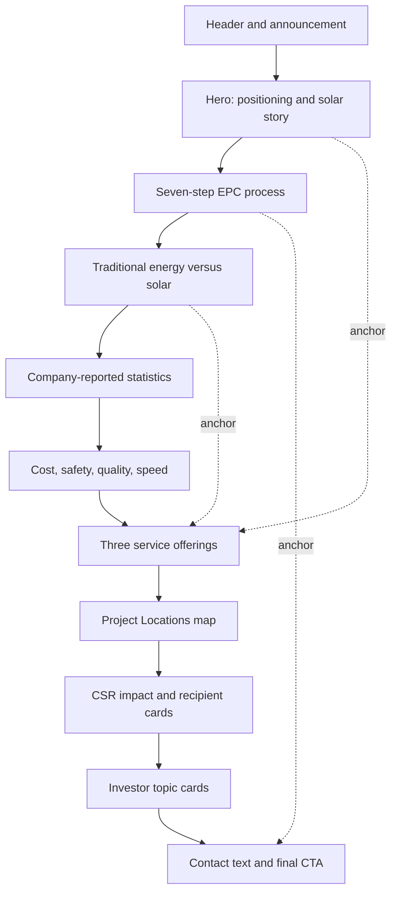
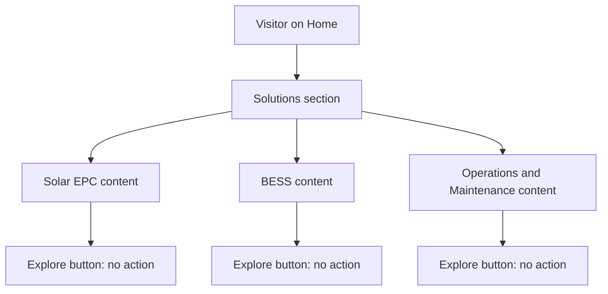
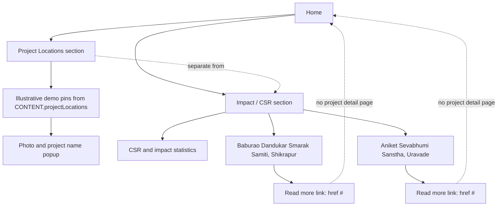
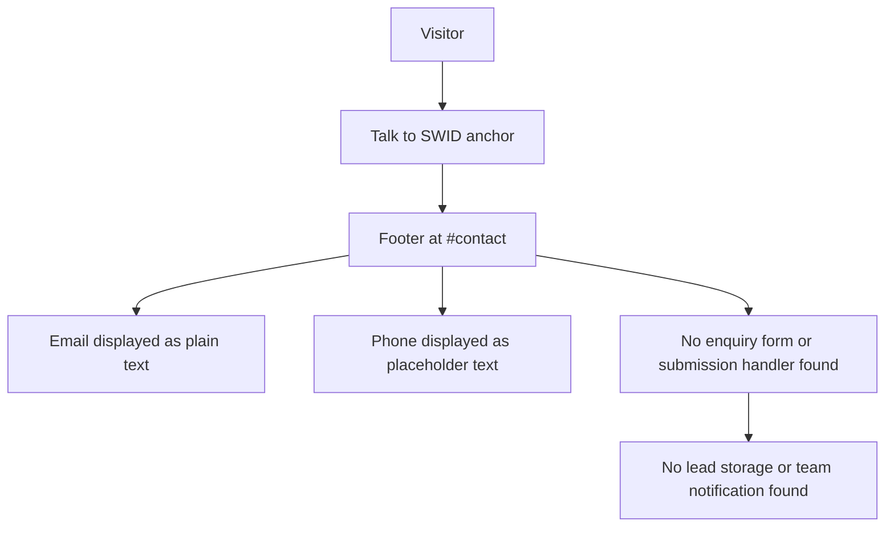
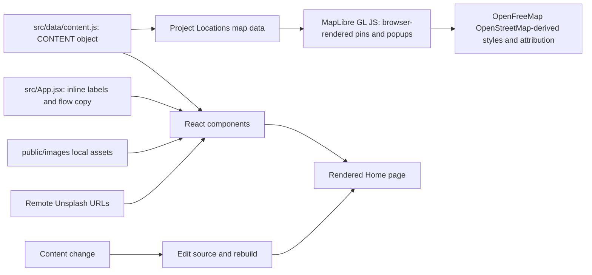
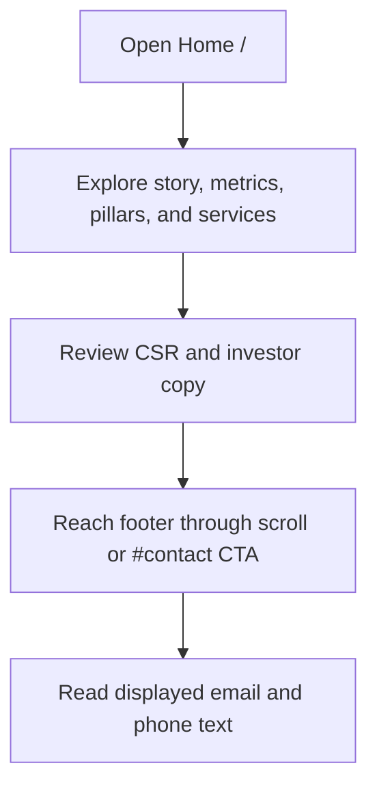
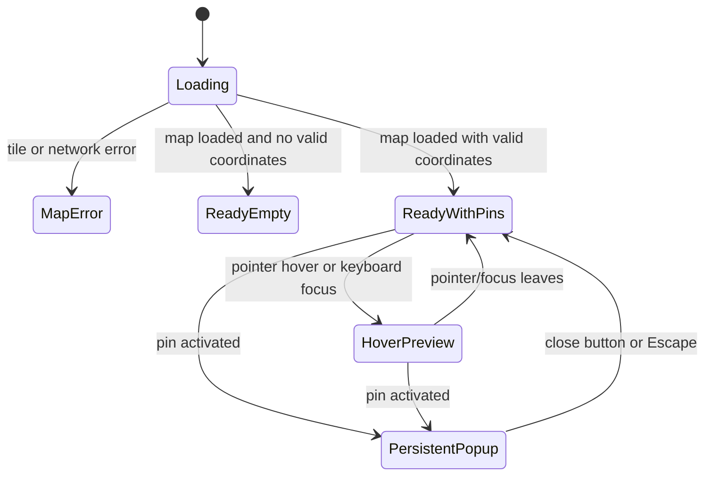

# SWID Modern Website — Project Documentation

> **Source of truth:** this document describes the implementation visible in this repository. Marketing statements and metrics below are reported as website copy, not independently verified company facts. If implementation and this document differ, inspect the code and update this document in the same change.

## Table of Contents

1. [Project Overview](#1-project-overview)
2. [Website Goals](#2-website-goals)
3. [Technology Stack](#3-technology-stack)
4. [Website Architecture](#4-website-architecture)
5. [Sitemap](#5-sitemap)
6. [Navigation](#6-navigation)
7. [Home Page](#7-home-page)
8. [Services](#8-services)
9. [Products and Solutions](#9-products-and-solutions)
10. [Industries](#10-industries)
11. [Projects and Case Studies](#11-projects-and-case-studies)
12. [About SWID](#12-about-swid)
13. [Contact and Lead Generation](#13-contact-and-lead-generation)
14. [Content Architecture](#14-content-architecture)
15. [Database](#15-database)
16. [Security](#16-security)
17. [SEO](#17-seo)
18. [Performance](#18-performance)
19. [Responsive Design](#19-responsive-design)
20. [Animations and Interactions](#20-animations-and-interactions)
21. [Design System](#21-design-system)
22. [Component Architecture](#22-component-architecture)
23. [User Journeys](#23-user-journeys)
24. [Master Business Rules](#24-master-business-rules)
25. [State and Flow Diagrams](#25-state-and-flow-diagrams)
26. [Current Implementation Status](#26-current-implementation-status)
27. [Known Gaps and Technical Debt](#27-known-gaps-and-technical-debt)
28. [Testing Checklist](#28-testing-checklist)
29. [Deployment](#29-deployment)
30. [Rules for Future AI and Lovable Development](#30-rules-for-future-ai-and-lovable-development)
31. [Change History](#31-change-history)

## 1. Project Overview

### Business perspective

| Item | Source-grounded description |
|---|---|
| Website name | SWID Modern Website (repository package: `swid-mordern-website`) |
| Company represented | SWID Renewables Limited, as named by the logo alt text and website copy |
| Purpose | Present SWID's renewable-energy offerings, approach, impact copy, investor topics, and contact information in a single scrolling marketing site. |
| Audience indicated by the copy | Commercial and industrial (C&I) businesses, utility-scale prospects, industrial clients, investors, and other company stakeholders. |
| Apparent business objectives | Explain services, communicate credibility through company-reported metrics and claims, and encourage visitors to contact SWID. These objectives are inferred from visible copy and CTAs; no analytics or conversion configuration was found. |
| Main conversion paths in code | Explore the solutions anchor; use “Talk to SWID” to jump to the footer; other CTAs are presentational or have no destination. There is no lead submission flow. |

### Technical perspective

This is a client-rendered React single-page application built with Vite. The page composition is in `src/App.jsx`, structured marketing content is in `src/data/content.js`, styling is in `src/index.css` and `src/apple-effects.css`, and static assets are served from `public/images/`. The Project Locations section uses MapLibre GL JS with tokenless OpenFreeMap vector styles based on OpenStreetMap data. No API, server application, database, authentication, form handler, or CMS integration was found in the inspected project source.

## 2. Website Goals

The website copy presents these goals:

- Position SWID as an engineering and renewable-energy partner for business facilities.
- Describe Solar EPC, battery energy storage, and operations and maintenance.
- Explain a seven-step rooftop solar project process.
- Present SWID's stated cost, safety, quality, and delivery pillars.
- Share company-reported scale and CSR figures and list investor-information topics.
- Direct interested visitors to the footer contact area.

These are presentation goals found in the interface. The code does not implement measurement, lead qualification, or a conversion analytics flow.

## 3. Technology Stack

| Area | Implementation |
|---|---|
| Frontend | React 19, rendered with `react-dom/client` |
| Build and development | Vite 8; `@vitejs/plugin-react` |
| Styling | Tailwind CSS 4 via `@tailwindcss/postcss`, plus authored CSS |
| Animation | Framer Motion |
| Icons | Lucide React |
| Interactive map | MapLibre GL JS with tokenless OpenFreeMap vector styles using OpenStreetMap data |
| Language | JavaScript and JSX, ES modules |
| Local content | JavaScript object and component literals |
| Backend/database/CMS | None found in the repository source |
| Hosting configuration | Netlify static build configuration and a GitHub Pages Actions workflow are present; the active production host/domain is not established by these files. |

Key entry points: `index.html`, `src/main.jsx`, `src/App.jsx`, `vite.config.js`, `package.json`.

## 4. Website Architecture

The visitor downloads a static Vite build. React mounts one `App` component, which renders the header, page sections, and footer. `CONTENT` supplies reusable data; additional narrative copy remains inline in components. Images are a mix of local public assets and remote Unsplash URLs. MapLibre GL JS fetches OpenFreeMap's OpenStreetMap-derived vector tiles in the visitor's browser without an access token. The theme choice is stored in the visitor's browser using `localStorage`.

## 5. Sitemap

There is one route, `/`. The following are section anchors on that route, not separate pages.

| Page | Route | Purpose | Audience | Main CTA | Status |
|---|---|---|---|---|---|
| Home | `/` | Present the company, process, proof points, services, public project locations, impact, investor topics, and contact details. | Business prospects and stakeholders indicated by the copy | Explore solutions; Talk to SWID (anchor links) | ✅ Implemented as a single-page UI; no separate route system |

No distinct About, service detail, product, industry, project case-study, contact, careers, blog, or news route was found. Some such labels appear in footer copy, but do not have implemented destinations.

## 6. Navigation

### Header and menu

- The logo links to `#home` and has alt text “SWID Renewables Limited”.
- Desktop navigation links are Overview (`#home`), Solutions (`#solutions`), Projects (`#project-locations`), Our approach (`#projects`), Impact (`#csr`), and Investors (`#investors`).
- An announcement strip links to `#solutions`.
- The header changes its scrolled styling after `window.scrollY > 50`.
- At the mobile breakpoint (CSS max-width 640px), a menu button opens a full-screen overlay. Selecting one of the six navigation links closes the overlay. No dropdown or mega-menu is implemented.
- The overlay also shows a “Get in Touch” button, but that button has no link or click handler.
- An appearance menu offers Light, Dark, and System modes.
- No active-section or active-page indicator was found. There is no multi-page route state.

### Footer navigation and contact

Footer Navigation labels are Home, Projects, Investors, CSR, Subsidiaries, and Career. Projects now links to `#project-locations`; the other links still use `href="#"`. Legal labels are Privacy Policy, Terms of Service, Compliance, and ESG Report; these also use `href="#"`. They are not implemented routes or external links. The contact email and phone are displayed as text, not `mailto:` or `tel:` links.

## 7. Home Page

The rendered order is `Navbar` and announcement strip, then the following sections, then the footer. The sticky header/announcement precedes the home hero.

| Order | Section | Purpose and content | CTA/destination | Assets and interaction |
|---:|---|---|---|---|
| 1 | Hero (`#home`) | “The Future is Bright.” and business-oriented solar positioning | Explore our solutions → `#solutions`; choose a numbered stage or scroll to navigate the story | Scroll story layers a full inset 6×6 solar-cell array with staggered cell animation and remote energy/project photographs; panel scales responsively to preserve copy and stage controls; local hero assets use the configured deployment base path; reduced-motion layout remains static and visible. |
| 2 | EPC process (`#growth`) | Describes survey through generation in seven steps | Talk to SWID → `#contact` at the final step; mobile CTA remains available | Scroll-driven step text and facility illustration; CSS adapts the layout for narrow screens. |
| 3 | Energy comparison (`#transition`) | Compares the “Burden of Tradition” with “Freedom of Solar” | Explore solar solutions → `#solutions` | Sticky, scroll-driven image and copy transition; progress indicator. |
| 4 | Scale statistics (no ID) | Displays four headline business metrics | None | Values from `CONTENT.stats`; animated reveal. |
| 5 | The Ecosystem (`#projects`) | Shows L1 cost, S1 safety, Q1 quality, and T1 timeline pillars | None | Four responsive cards with local SVG backgrounds and hover effects. Despite the `#projects` id, this is not a project portfolio. |
| 6 | Our Solutions (`#solutions`) | Describes Solar EPC, BESS, and O&M with feature lists | “Explore [service]” button; no destination or handler | Remote Unsplash images; card and feature reveal animations. |
| 7 | Project Locations (`#project-locations`) | Displays six clearly labeled illustrative demo pins at approximate Indian city centers from `CONTENT.projectLocations`, arranged to resemble the supplied reference image; these are not actual SWID projects | Initial map fit animates to all valid coordinates; hover/focus previews artwork and click/tap opens a persistent popup | MapLibre GL JS with tokenless OpenFreeMap vector styles based on OpenStreetMap data; India default center for empty or coordinate-invalid data; base-path-aware local artwork. Requires network access, not a token. |
| 8 | Impact (`#csr`) | Presents a CSR contribution, two impact metrics, and two named CSR recipient projects, separate from the solar map | Informational cards; no fake detail links | SWID-blue animated contribution card, motion-enhanced metric/recipient cards, and a responsive quote panel. Placeholder SVG artwork is not displayed as photography. |
| 9 | Investor relations (`#investors`) | Lists six investor-information categories | “View” buttons have no action | Staggered cards; no linked reports or documents in code. |
| 10 | Footer/contact (`#contact`) | Company description, contact text, navigation/legal placeholders, final CTA | “Start Your Journey” button has no handler | Local logo; animated visual treatment and current-year copyright. |

## 8. Services

The page has no individual service routes. These services are rendered as sections within `/` from `CONTENT.solutions`.

| Service | Description in website copy | Customer indicated by copy | Listed capabilities | CTA behavior | Status |
|---|---|---|---|---|---|
| Solar EPC | End-to-end engineering, procurement, and construction for utility and C&I scale | Utility and C&I businesses | Land acquisition, design and engineering, procurement, construction, commissioning | “Explore Solar EPC” button is presentational; no navigation or submit action | UI implemented; conversion path incomplete |
| BESS (Battery Storage) | Storage for peak shaving, backup, and grid services | Business/grid-service prospects implied by copy | LFP chemistry, EMS integration, fire safety, remote monitoring, modular design | “Explore BESS” button is presentational | UI implemented; conversion path incomplete |
| Operations & Maintenance | Copy describes predictive maintenance and plant availability | Existing solar-plant operators implied by offering | SCADA, drone thermography, auto ticketing, performance analytics, 24/7 NOC | “Explore Operations & Maintenance” button is presentational | UI implemented; conversion path incomplete |

No service enquiry fields, service-specific lead routing, related-service links, or service detail pages exist in the inspected code.

## 9. Products and Solutions

No distinct product catalog, packages, pricing, or product routes were found. BESS and Solar EPC are presented as solutions/services, not as separately purchasable products. The seven-step EPC story is explanatory website content; the repository does not implement project-management functionality.

## 10. Industries

The code explicitly mentions utility-scale and C&I-scale projects, industrial clients, and business facilities. It does not enumerate named vertical industries such as manufacturing, healthcare, or retail. It does not associate a customer segment with a dedicated service page, filtered content view, or industry-specific project.

## 11. Projects and Case Studies

There is no EPC project portfolio, customer case study, project filter, or project detail route. The Impact section contains two CSR recipient cards:

| Name shown | Location shown | Contribution shown | Description shown |
|---|---|---:|---|
| Baburao Dandukar Smarak Samiti | Shikrapur | ₹1,50,000/- | Copy says support is dedicated to nurturing young learners in a rural environment. |
| Aniket Sevabhumi Sanstha | Uravade | ₹1,00,000/- | Copy says support is for residential institutions for differently abled children. |

These are documented as CSR items because that is where the code places them; do not treat them as solar EPC case studies. Their “Read more” links currently point to `#`.

The separate Project Locations section is a code-maintained solar-project map, not a case-study page. `CONTENT.projectLocations` currently contains six records explicitly named `DEMO`, placed at approximate Jaipur, Ahmedabad, Bhopal, Hyderabad, Bhubaneswar, and Visakhapatnam city centers to approximate the broad pin arrangement in the supplied reference image. They and their shared solar artwork exist only to demonstrate the map, not to represent actual SWID projects or approved sites. Each record has `id`, `name`, `latitude`, `longitude`, `image`, and `imageAlt`; the artwork is stored under `public/images/`. Only finite latitude/longitude values within geographic bounds become pins. Before publishing real project locations, replace the demo records with exact coordinates and imagery approved for public display.

## 12. About SWID

There is no dedicated About page or About section. The footer describes SWID as a leading Indian renewable-energy EPC partner and states that it engineers sustainable futures for businesses. No company history, mission/vision statement, leadership, team biographies, milestone timeline, location list beyond “India,” or certification detail page is implemented. Copy such as “ISO 45001 Certified” appears as a claim in a pillar metric; the repository does not verify the certification.

## 13. Contact and Lead Generation

### Implemented mechanisms

- “Talk to SWID” links in the EPC process jump to the footer anchor `#contact`.
- Footer displays `contact@swid.in`, “India,” and a phone string shown as `+91 ...`.
- Email and phone are non-interactive text; there is no `mailto:` or `tel:` URL.

### Not implemented

No contact/enquiry form, fields, validation, success/error state, backend/API submission, lead database, notification, spam protection, WhatsApp link, or scheduling/demo flow was found. The separate Project Locations map is not a contact or lead-generation feature. The mobile menu “Get in Touch” and footer “Start Your Journey” buttons have no action handlers. Therefore there is no lead submission or confirmation flow to document.

## 14. Content Architecture

Content is local and code-managed, not CMS-driven:

- `src/data/content.js` exports the `CONTENT` object with hero, transition, pillars, statistics, solutions, CSR and footer data.
- `CONTENT.projectLocations` currently contains six illustrative records with `id`, `name`, `latitude`, `longitude`, `image`, and `imageAlt`. Replace these demos with approved project data before publication. To add a project image, add its file under `public/images/` and store a path relative to `public/` (for example `images/example-project.jpg`); no CMS or database is involved.
- Some content remains inline in `src/App.jsx`, including navigation labels, the seven project steps, transition point lists, investor topics, and footer labels.
- Local images live under `public/images/`; components reference them through `import.meta.env.BASE_URL` in most cases.
- Four solution/hero image sources use remote Unsplash URLs. Remote delivery depends on the external image host and network access.
- No content authoring UI, publishing workflow, localization system, Markdown content source, or content API was found.

### Local asset inventory

- `swid-brand-logo.png`: used in the header and footer.
- `hero-solar-cell.svg`: single detailed solar-cell artwork repeated in the hero's 6×6 array.
- `l1-cost.svg`, `s1-safety.svg`, `q1-quality.svg`, `t1-speed.svg`: used by the four pillar cards.
- `csr-main.svg`, `shikrapur.svg`, `uravade.svg`: placeholder illustrations retained under `public/images/`; the Impact UI no longer presents them as photography.
- `bess-storage.svg`, `om-maintenance.svg`, `solar-epc.svg`, `solar-farm.jpg.svg`: present in `public/images/` but not referenced by the inspected source.
- No standalone font files or custom icon set were found; interface icons come from Lucide React.

## 15. Database

No database client, schema, migration, SQL file, Supabase configuration, or database-backed content was found in the repository. Tables, relationships, RLS policies, database functions, triggers, storage buckets, and indexes are therefore not applicable to this implementation. No database relationship diagram is included.

## 16. Security

- No authentication, authorization roles, private application data, API server, or database access was found.
- The Project Locations map uses tokenless OpenFreeMap styles derived from OpenStreetMap data through MapLibre GL JS. OpenFreeMap documents commercial use as permitted and requires attribution; see the [quick start and attribution guidance](https://openfreemap.org/quick_start/). Map tiles still require network access.
- Contact details are static page copy; they are not submitted to a server by this project.
- External Unsplash images and OpenFreeMap vector tiles are fetched from third parties. No analytics script was found in the inspected source.
- The map displays the OpenFreeMap/OpenMapTiles/OpenStreetMap attribution specified by the map style. No private or secret token is used.
- No server-side form protection, authorization, or row-level security is applicable because there is no server-backed feature in the repository.

This is a source inspection, not a penetration test or an audit of hosting account settings.

## 17. SEO

The repository has a single HTML document title and basic viewport/theme metadata. No per-route SEO system exists because the site has no client-side routes.

| Page | Title | Description | Canonical | SEO status |
|---|---|---|---|---|
| Home `/` | `SWID | Powering Profits` | Not present in `index.html` | Not present | Basic title/viewport only; no OG/Twitter metadata or structured data found |

No `robots.txt`, sitemap file, canonical URL, Open Graph tags, Twitter/X tags, or JSON-LD schema was found in the project file inventory. Images in major sections have alt text, while decorative hero images use empty alt text and `aria-hidden`. Runtime search indexing, canonical host, and deployed metadata were not verified.

## 18. Performance

- Vite creates a static production build; MapLibre GL JS is dynamically imported only when its map section nears the viewport.
- Framer Motion powers multiple scroll and viewport animations. Global CSS responds to `prefers-reduced-motion`; the hero and EPC story also have reduced-motion layouts/behavior.
- Remote Unsplash images are used for several prominent visual sections. Their availability, latency, and optimization are external to the repository.
- OpenFreeMap vector tiles load at runtime; their availability and provider terms govern usage.
- MapLibre GL JS is a separate lazy-loaded chunk and is requested only as the map nears the viewport.
- MapLibre's worker is bundled as a separate local asset so it also resolves under the GitHub Pages base path. The GL library and worker are relatively large chunks; Vite may report its configured size warning for the library.
- Two hero photos are explicitly eager-loaded; other images do not specify native lazy loading in the JSX inspected.
- The local logo is a 2072×750 PNG; the remaining listed local images are SVGs.
- The hero solar-cell artwork uses `import.meta.env.BASE_URL`, so it resolves under both root hosting and the `/swidwebsite/` GitHub Pages base path.
- No service worker, explicit cache policy, custom font download, video, or third-party analytics script was found.

## 19. Responsive Design

The stylesheet defines project-specific breakpoints at 640px, 760px, 900px, and 1000px, plus a reduced-height mobile rule and `prefers-reduced-motion` rule. Tailwind responsive utilities are also used in JSX.

| Viewport | Implemented behavior |
|---|---|
| Desktop | Full header links; wide two-column and multi-column layouts; sticky scroll stories and large visual sections. |
| Tablet | CSS at 900px adjusts content widths, grids, spacing, and the approach layout; 761–1000px has a dedicated EPC story layout adjustment. |
| Mobile | At 640px and below, desktop links hide and the full-screen menu toggle appears; card grids collapse, typography and spacing shrink, and EPC process content changes to a compact vertical layout with a numbered seven-step strip. |
| Reduced height | At mobile heights up to 720px, the EPC scene and copy are further compacted. |
| Short viewport | At widths up to 640px and heights up to 580px, the solar-story hero compacts copy and scales the panel to available height so the full solar array and stage controls remain visible; desktop viewports up to 820px tall reduce hero spacing and panel size to keep the panel, stage controls, and caption in view. |
| Reduced motion | CSS reduces animation/transition duration and scroll behavior; hero/EPC motion code also switches to less scroll-dependent layouts. |

Project Locations uses a responsive map canvas (560px desktop, 440px at mobile widths). Pins are keyboard-focusable buttons; hover previews supplement, but do not replace, focus and click/tap activation.

The map was spot-checked in a desktop browser and at a 390px viewport; a complete device/browser matrix is not stored in the repository.

## 20. Animations and Interactions

| Interaction | Trigger | Behavior | Mobile/reduced-motion notes |
|---|---|---|---|
| Header style | Scroll past 50px | Adds scrolled style to navigation | Same rule at all widths |
| Mobile navigation | Menu button click | Opens full-screen menu; selecting one of six links closes it | Shown at max-width 640px |
| Appearance | Appearance button and option click | Sets light, dark, or system theme | Persists selected mode in local storage |
| Hero story | Raw scroll progress or activate one of five numbered stage buttons | Photo layers, panel movement, labels, and progress track the same scroll position without spring lag; the illustrated cell array fades out after stage two as the rooftop solar-panel photo fades in, followed later by the powered rooftop handoff; selecting a stage smoothly scrolls to that story point | Stage buttons are keyboard-operable and stay synchronized with the active story position; powered glow is disabled for reduced motion |
| Hero solar cells | Hero loads or pointer hovers over the panel | Thirty-six individual solar cells fill the inset panel in a staggered sequence; hover gently brightens the cells | Animation is decorative and suppressed by the global reduced-motion rule |
| EPC process | Scroll through `#growth` | Selects one of seven copy/illustration states | Reduced-motion state presents the last step and a static layout |
| Energy comparison | Scroll through `#transition` | Crossfades conventional-energy and solar copy/images | CSS changes the layout at mobile widths |
| Content reveals | Elements enter viewport | Fade/stagger/card reveals via Framer Motion | Global reduced-motion CSS shortens animation durations |
| Hover | Pointer over buttons/cards | Visual movement, glow, color, or image scaling | Hover is supplementary; no carousel, tabs, accordions, or modal flow found |
| CSR impact cards | Cards enter viewport or receive pointer hover | Contribution, metrics, and recipient cards reveal with restrained motion; decorative rings and quote sheen add ambient movement | Framer Motion and CSS animations respect reduced-motion preference; card text remains static and available |
| Project map | Map loads when its section nears the viewport | OpenFreeMap Positron style in light theme and Dark style in dark theme; empty list centers India, configured coordinates animate into fitted bounds | Uses local images with base path; style/network failures show a readable fallback |
| Project pin preview | Hover or keyboard focus | Temporarily opens that project's photo and name | Pins are buttons, so touch users can activate without hover |
| Project pin popup | Click/tap or keyboard activation | Keeps the photo/name popup open until its close button or Escape is used | Image failures show fallback text |

## 21. Design System

- **Brand colors:** SWID blue `#0f61ab` is the default accent in Tailwind and shared custom styles; charcoal `#1A1A1A`, white `#FFFFFF`, and muted gray `#86868B` remain supporting colors. Interactive hover states use a darker blue derived from the brand color.
- **Additional CSS variables:** near-black background, light text, muted gray, pale green `#b9f1d3`, and translucent divider lines.
- **Typography:** native system stacks in the base stylesheet; Tailwind config names Inter and SF Pro Display, but no font asset or font-loading declaration was found. The two declarations should not be assumed to mean those fonts are bundled.
- **Layout:** centered max-width content, responsive grids, large section spacing, sticky narrative panels, and card-based service/impact content.
- **Buttons/cards:** rounded blue CTA treatments, pill buttons in narrative sections, large rounded cards, subtle border/glow/hover states.
- **Icons:** Lucide React icons.
- **Breakpoints:** project CSS at 640px, 760px, 900px, and 1000px; Tailwind breakpoint utilities also occur in JSX.
- No Storybook or standalone design-token package was found.

## 22. Component Architecture

Components are currently defined in `src/App.jsx`; the repository does not have a separate reusable component library directory.

| Component | Purpose | Used by | Reusable? |
|---|---|---|---|
| `FadeInUp` | Viewport-triggered fade/vertical reveal | Section and investor headings | Yes, internal helper |
| `StaggerContainer`, `StaggerItem` | Staggered reveal wrappers | Cards and lists | Yes, internal helpers |
| `LiquidButton` | Animated button wrapper | Mobile menu, solution cards, footer CTA | Yes; current instances may lack actions |
| `SectionHeader` | Shared section title/subtitle | Stats, pillars, solutions, impact | Yes |
| `IconRenderer` | Maps string keys to Lucide icons | No call site found in current `App` | Defined; appears unused |
| `Navbar` | Logo, section navigation, theme selector, mobile menu | Home | Single page |
| `Hero`, `Growth`, `Transition` | Narrative/scroll sections | Home | Page-specific |
| `StatsCounter`, `Ecosystem`, `Solutions`, `ProjectLocations`, `Impact`, `InvestorsSection` | Main content sections | Home | Page-specific |
| `Footer` | Contact copy, placeholder links, final CTA | Home | Single page |
| `ScrollProgress` | Fixed overall page scroll indicator | App | Reusable helper |
| `App` | Theme state and page composition | React root | Application entry component |

## 23. User Journeys

Only the journeys below are supported by the current page. Service enquiry, project-detail discovery beyond map previews, and actual lead submission are not end-to-end flows.

### General visitor

### Service discovery

### Project/CSR discovery

Visitors select Projects in the header/footer or scroll to `#project-locations`. If the OpenFreeMap OpenStreetMap-derived tiles load, they explore six clearly labeled illustrative demo pins, focus/hover a pin to preview artwork and its demo name, and activate a pin to keep the popup open. The close control or Escape dismisses it. The demo coordinates are approximate city centers, not actual SWID projects; style/network failures have a visible fallback message. The later CSR section remains a separate visitor journey; its recipient cards are not solar project pins.

### Contact

See [Contact and Lead Generation](#13-contact-and-lead-generation): “Talk to SWID” jumps to static contact text; the implementation does not submit or store a lead.

## 24. Master Business Rules

These rules describe behavior implemented in the client. Marketing claims and static values are not treated as verified business rules.

| Rule ID | Module | Rule | Trigger | Expected behavior | Exception | Source | Status |
|---|---|---|---|---|---|---|---|
| WEB-BR-001 | Header navigation | Header navigation consists of six configured section anchors: Home, Solutions, Projects, Approach, Impact, Investors. | Visitor selects a header/menu link | Browser navigates to the corresponding hash on `/`. | These are same-page anchors, not routes. | `src/App.jsx:120-127` | Implemented |
| WEB-BR-002 | Mobile menu | Mobile menu toggles open/closed; selecting a navigation item closes it. | Menu toggle or mobile menu link click | The overlay state changes; a selected menu link closes the overlay. | “Get in Touch” overlay button has no action. | `src/App.jsx:110-112,188-196,205-230` | Partially implemented; CTA incomplete |
| WEB-BR-003 | Theme selection | Supported preference values are `light`, `dark`, and `system`. | Initial load or appearance-option selection | A valid stored selection is restored; unsupported/missing values fall back to `system`. | Storage access failure also falls back to `system`. | `src/App.jsx:114-119,968-974` | Implemented |
| WEB-BR-004 | System theme | In System mode, active theme follows the device color-scheme preference and listens for changes. | Device color-scheme setting changes | App updates between light and dark. | Listener uses the legacy API when modern media-query listeners are unavailable. | `src/App.jsx:978-1001` | Implemented |
| WEB-BR-005 | Theme persistence | Selected theme mode is saved in local storage under `swid-theme`. | Theme state changes | Future loads can restore the saved selection. | Storage write errors are caught and ignored. | `src/App.jsx:993-999` | Implemented |
| WEB-BR-006 | Header appearance | Scrolled header styling activates when `window.scrollY > 50`. | Page scroll | Header receives the scrolled class. | No active section/page tracking is implemented. | `src/App.jsx:128-132,136` | Implemented |
| WEB-BR-007 | Hero story | Hero story stage label is selected from scroll progress thresholds at 0.16, 0.39, 0.68, and 0.83. | Scroll progress through hero | Stage label tracks solar cell, survey, installation, power, and final SWID state. | State updates are skipped when reduced motion is preferred. | `src/App.jsx:266-279` | Implemented |
| WEB-BR-008 | EPC story | EPC copy/scene has seven ordered steps selected from progress through its sticky section. | Scroll or viewport resize within EPC section | Active step and progress indicator update. | Reduced-motion mode skips scroll updates and displays the final step in a static layout. | `src/App.jsx:371-435,550-555`; `src/index.css:241-249` | Implemented |
| WEB-BR-009 | Contact CTA | “Talk to SWID” anchors target the footer element `#contact`. | Visitor activates an EPC CTA | Browser jumps to the footer. | No form, `mailto:`, `tel:`, or submission behavior follows. | `src/App.jsx:461,474,902` | Anchor implemented; lead flow absent |
| WEB-BR-010 | Dynamic content display | Pillars, stats, services, CSR statistics, and CSR cards render from local arrays/objects. | App renders the Home page | Each configured content entry is mapped to a UI item. | Content editing requires source changes and a rebuild; no CMS is connected. | `src/data/content.js:24-123`; `src/App.jsx:649-860` | Implemented as static content |
| WEB-BR-011 | Public project locations | Only project records with finite, geographically valid coordinates are rendered as map pins. | Home page loads | Map animates to fit all valid coordinates; if there are no valid records, it centers on India and shows the empty state. | Current records are clearly labeled demos with approximate city-center coordinates; they are not actual SWID project sites. Production records require exact, publicly approved coordinates, name, local image path, and alt text. | `src/data/content.js`; `src/App.jsx` (`ProjectLocations`) | Implemented with illustrative demo data |
| WEB-BR-012 | Project map access and popup | OpenFreeMap's OpenStreetMap-derived vector styles load without an access token; marker artwork/name preview appears on hover or focus and persists after activation until closed. | Map load or pin interaction | Styles load when network/provider are available; initial coordinate fit animates; style/network failure shows a clear fallback. Popup can be closed by its close control or Escape; broken image has fallback text. | Demo image is illustrative, not project photography. OpenFreeMap/OpenMapTiles/OpenStreetMap attribution is required; hover is not required on touch. | `src/App.jsx` (`ProjectLocations`) | Implemented; live tile availability depends on network/provider |

## 25. State and Flow Diagrams

The key state diagrams are included above with their related modules. The visitor does not enter data, authenticate, or receive a server response in the current application, so no form-state, auth-state, or database flow diagram applies.

## 26. Current Implementation Status

Status refers to what is present in source, not production readiness. The repository has no real automated test suite, so runtime behavior has not been marked as tested here.

| Feature/Page | Status | Frontend | Backend | Tested | Notes |
|---|---|---|---|---|---|
| Home page and ten content sections | ✅ Implemented | React single page | None | Production build passed; hero stage controls and asset behavior verified in browser at desktop and mobile viewports | Content and metrics are static. Hero story is scroll- and button-navigable with reduced-motion support. |
| Section navigation and mobile overlay | 🟡 Implemented but needs testing | Anchor links and React state | None | No test suite found | Projects links reach the map; other footer links and overlay contact button remain placeholders. |
| Light/dark/system appearance | ✅ Implemented | React state, CSS themes, local storage | None | No test suite found | Preference storage exceptions are caught. |
| Solar EPC scroll story | ✅ Implemented | Scroll-based seven-step presentation | None | No test suite found | Describes a process; does not operate an EPC workflow. |
| Solar EPC, BESS, and O&M content | 🟡 Implemented but needs testing | Static cards and features | None | No test suite found | “Explore” controls have no destinations/actions. |
| CSR impact section | ✅ Implemented | Animated contribution and metric cards, informational recipient cards, and quote panel | None | Production build passed; desktop/mobile layout, non-overlapping contribution value, no placeholder photography/dead links, and reduced-motion styling checked in browser | Displays the existing impact copy and amounts; cards do not link to case studies. |
| Project Locations map | 🟡 Implemented with illustrative demo data | MapLibre GL JS, tokenless OpenFreeMap/OpenStreetMap-derived vector styles, six city-center demo pins, accessible interactive markers | Public OpenFreeMap service; no SWID backend | Root and `/swidwebsite/` production builds passed; root browser check confirmed all six pins fit the map and the sixth pin opens its popup with the local illustration. Previous keyboard, 390px layout, and image-failure fallback checks were run with ten pins. Pages-path browser behavior and full device/browser matrix remain unverified. | Demo coordinates are approximate and not real SWID projects; all pins use local illustrative artwork. No token required. Style/network and image-error fallbacks are implemented. |
| Investor topic cards | 🔴 Known issue | Cards and “View” buttons render | None | No test suite found | Buttons have no action or document links. |
| Contact/lead submission | 🔴 Known issue | Contact text and anchor CTAs only | None | Not applicable | No form or submission endpoint exists. |
| SEO metadata | 🟡 Implemented but needs testing | One title and basic metadata | None | Not verified in deployment | Description, canonical, OG, social cards, schema, sitemap, and robots file not found. |
| Netlify build configuration | ✅ Implemented | Static build config | Netlify build target configured | No deployment verification here | Active production domain/target unknown. |
| GitHub Pages deployment workflow | ✅ Implemented | GitHub Actions workflow | Pages deployment action | No deployment verification here | Workflow triggers on `main`, `development`, and manual dispatch. |

## 27. Known Gaps and Technical Debt

- **No separate routes:** About, service details, projects, contact, careers, and legal/report pages are not implemented as pages.
- **Contact is not a lead flow:** no form, validation, backend, lead store, notification, or direct email/phone links. Phone copy is `+91 ...`.
- **Inactive controls:** “Explore [service]”, investor “View”, CSR “Read more”, mobile menu “Get in Touch”, and footer “Start Your Journey” do not have meaningful destinations/actions. Footer link groups use `href="#"`.
- **No CMS or dynamic data source:** page copy and claims are maintained in source files.
- **Project map demos are not production records:** `CONTENT.projectLocations` currently contains six illustrative city-center examples. Replace them with approved project coordinates and images before publication. The tokenless OpenFreeMap basemap requires a network connection.
- **SEO is minimal:** only title, viewport, and theme color are present in the HTML head; other SEO files/tags were not found.
- **Remote image dependency:** several visuals use Unsplash URLs, so image loading depends on the third party.
- **Content review needed:** performance figures, savings, warranties, certifications, and impact amounts are static site claims; no source-of-truth integration or verification mechanism exists here.
- **No tests:** the package test command intentionally exits with “no test specified”; no component, unit, end-to-end, or accessibility tests were found.
- No TODO/FIXME/WIP marker was found in application source during inspection; absence of markers does not imply every feature is complete.

## 28. Testing Checklist

This is a proposed manual/automated verification checklist. Root and `/swidwebsite/` production builds passed after the latest hero layout change. Root browser verification confirmed the solar-story controls remain within the viewport at 552×445; full device/browser coverage remains incomplete. Root browser verification also confirmed all six pins fit the map and the final pin opens a popup with its local illustration. Earlier browser checks with ten pins confirmed keyboard activation, Escape dismissal, a 390px layout, and the image-failure fallback; those checks have not all been repeated with the revised six pins. Pages-path browser behavior and a full device/browser matrix remain unverified.

### Navigation

- [ ] Verify the logo and all six header anchors reach the matching sections.
- [ ] Verify the mobile menu opens, closes, and closes after a navigation selection.
- [ ] Verify footer `href="#"` links and no-op buttons are resolved or intentionally retained before release.
- [ ] Verify no invalid or missing anchor targets.

### Page sections and content

- [ ] Verify all ten content sections appear in the documented order.
- [ ] Verify Project Locations appears between Solutions and CSR; verify the six demo pins, animated coordinate fit, India default center for empty data, and invalid-coordinate filtering.
- [ ] Confirm static metrics, service copy, CSR recipients, and investor labels with the business owner before publishing.
- [ ] Confirm local images load and have appropriate alternatives/decorative treatment.
- [ ] Verify remote image availability or replace external assets if required.

### Appearance and interaction

- [ ] Verify light, dark, and system modes, reload persistence, and OS theme changes.
- [ ] Verify scroll progress and hero/EPC/transition story states; activate all hero stage buttons by pointer and keyboard.
- [ ] Verify reduced-motion experience with OS preference enabled.
- [ ] Verify all controls are keyboard-operable and menus have appropriate focus/escape behavior.
- [ ] With network access, verify desktop hover preview, click/tap persistent popup, keyboard focus/activation, Escape/close control, image failure fallback, and light/dark map treatment.

### Contact and investor paths

- [ ] Decide and verify intended contact behavior; there is currently no lead form or submission.
- [ ] Verify displayed email/phone details and make them actionable if required.
- [ ] Verify investor controls point to real documents if that capability is added.

### Responsive and accessibility

- [ ] Review desktop, tablet, mobile, and short-mobile-height layouts.
- [ ] Check heading order, contrast, focus visibility, accessible names, and screen-reader navigation.
- [ ] Test touch targets and ensure scroll stories remain understandable without animation.
- [ ] Verify CSR contribution amount does not overlap or wrap awkwardly; check recipient cards and section animations on desktop/mobile and with reduced motion enabled.

### SEO and deployment

- [ ] Confirm title and add/verify description, canonical, Open Graph, social metadata, sitemap, and robots behavior if required.
- [ ] Build with root base for Netlify and `/swidwebsite/` for GitHub Pages; verify all local assets, including the base-aware solar-cell background.
- [ ] Verify project map assets under root and `/swidwebsite/` paths; test tile/network and image-failure fallbacks.
- [ ] Verify deployment target, custom domain, and production metadata in the hosting accounts; these are not established by repository files.

## 29. Deployment

| Target/configuration | Repository evidence |
|---|---|
| Build command | `npm run build` |
| Output directory | `dist` |
| Netlify | `netlify.toml` runs the build and publishes `dist`; sets `VITE_BASE_PATH = "/"`. |
| GitHub Pages | `.github/workflows/deploy-pages.yml` installs with `npm ci`, builds with Node 22 and `VITE_BASE_PATH: /swidwebsite/`, uploads `dist`, then deploys Pages. Push triggers are `main` and `development`; workflow dispatch is also enabled. |
| Local development | `npm run dev`; Vite config binds `0.0.0.0` at port `4173`. |
| Environment settings | `VITE_BASE_PATH` controls the public base path. Project Locations requires no token or provider-specific environment variable. |
| Production domain/provider | Unknown from repository configuration; the existence of both deployment configs does not establish which is live. |
| Preview environment/branch policy | Not documented in the inspected repository. |

## 30. Rules for Future AI and Lovable Development

1. Read `PROJECT.md` before significant changes and inspect the current implementation; this document is not a substitute for source code.
2. Reuse existing components and content structures where they fit; avoid creating duplicate behavior.
3. Do not invent pages, integrations, business rules, content claims, or customer details. Confirm product decisions when source and request do not specify them.
4. Do not change business behavior, analytics, form handling, hosting, or SEO policy unless the task asks for it.
5. Inspect all current navigation references before changing routes or section IDs; update the sitemap and navigation diagrams when they change.
6. Inspect shared component call sites before changing shared behavior.
7. Check asset references before renaming/removing assets and account for both root hosting and the GitHub Pages subpath.
8. Preserve accessibility labels, meaningful alt text, and reduced-motion behavior; verify keyboard operation after interaction changes.
9. Do not claim a feature is complete based on UI alone; verify the complete path and document missing backend behavior.
10. Never expose secrets, credentials, private tokens, or copied customer data. Do not weaken security controls to compensate for frontend limitations.
11. Check desktop and mobile layouts after significant interface changes.
12. Preserve working deployment and SEO behavior unless explicitly asked to change it; record the actual result and any unverified deployment assumptions.
13. Update affected `PROJECT.md` sections, business rules, diagrams, status, testing checklist, and change history in the same change as meaningful implementation work.
14. Clearly identify untested or unfinished behavior; report which checks ran and which did not.
15. Do not add a database, CMS, route, form, or integration merely because it appears in a generic documentation checklist.

`AGENTS.md` at the repository root repeats the documentation-maintenance requirement for agents that load repository instructions. It does not force arbitrary editors, commits, or external tools to update this file automatically.

## 31. Change History

| Date | Change | Page/Module | Business Rule Changed? | Database Changed? | Status |
|---|---|---|---|---|---|
| 2026-10-05 | Created source-grounded project documentation and repository instructions for keeping it current. | Whole website | No | No | Complete |
| 2026-10-05 | Added the source-maintained Project Locations map, navigation anchors, accessible pin previews/popups, and empty/error states. Root and Pages-base production builds and fallback states were verified; live tile and pin interactions require network access and approved records. | Home / Project Locations | Yes | No | Implemented; live tile/pin verification pending |
| 2026-10-05 | Replaced the token-based Mapbox provider with MapLibre GL JS and tokenless OpenFreeMap vector styles based on OpenStreetMap after configuration feedback. Removed token environment setup, bundled the map worker for subpath hosting, and added provider attribution. Verified Pages-path live map rendering in light and dark themes at a 390px viewport; pin testing still needs approved records. | Home / Project Locations | Yes | No | Implemented; pin data and interaction verification pending |
| 2026-10-05 | Added ten prominently labeled illustrative city-center demo pins and local solar artwork, and animated the map's initial fit to the demo coordinates. Documented that the examples are not real SWID projects. | Home / Project Locations | Yes | No | Implemented; production records must replace demos before publication |
| 2026-10-05 | Replaced ten illustrative pins with six approximate city-center demo locations arranged to resemble the supplied map reference, and updated the section and documentation to clarify their illustrative status. | Home / Project Locations | Yes | No | Implemented; coordinates are approximate, not verified project sites |
| 2026-10-05 | Set SWID brand blue `#0f61ab` as the default shared accent across Tailwind, custom page styles, map markers, and interactive controls. | Shared design system | No | No | Implemented |
| 2026-10-05 | Reworked CSR impact visuals to remove overlapping contribution text and placeholder photography, improved responsive hierarchy, and added reduced-motion-aware card reveals and subtle brand animations. Removed nonfunctional recipient “Read more” links. Production build and desktop/mobile/reduced-motion browser checks passed. | Home / Impact | No | No | Implemented and visually verified |
| 2026-10-05 | Improved the homepage solar-cell story with a larger stagger-animated panel, keyboard-accessible direct stage navigation, clearer progress cues, and a base-path-aware solar-cell asset. Root production build passed; desktop/mobile rendering and direct stage selection verified. | Home / Hero | No | No | Implemented and visually verified |
| 2026-10-05 | Fixed the short-mobile hero layout so its stage controls fit within short viewports; verified control visibility at 552×445 and rebuilt root and GitHub Pages variants. | Home / Hero | No | No | Implemented; short-viewport controls verified |
| 2026-10-05 | Expanded the solar panel to fill the hero visual at mobile widths and increased its desktop scale; added height-aware sizing to prevent the panel from crowding copy or stage controls. Root build and mobile/desktop viewport sizing checks passed. | Home / Hero | No | No | Implemented and visually verified |
| 2026-10-05 | Replaced the sparse 4×4 sprite crop with a full inset 6×6 array of detailed blue solar cells, matching the supplied panel reference while retaining staggered entrances and responsive framing. | Home / Hero | No | No | Implemented; production build passed |
| 2026-10-05 | Added the local SWID brand logo in a centered, high-contrast badge over the hero solar array. Production build and mobile browser check confirmed the loaded logo is centered over the panel while stage controls remain visible. | Home / Hero | No | No | Reverted at user request |
| 2026-10-05 | Kept the solar array visible through stage three, softened its installation tilt/settle motion, and added a restrained powered-state glow for stage four and the final stage. Production build, stage-state browser checks, and reduced-motion behavior verified. | Home / Hero | No | No | Implemented and verified |
| 2026-10-05 | Refined hero sizing after visual review: capped the panel by viewport height, compacted short-mobile copy, and kept the complete panel clear of stage controls. Production build and five desktop/mobile/short-viewport layout checks passed. | Home / Hero | No | No | Implemented and verified |
| 2026-10-05 | Removed the centered logo badge from the hero solar array as requested; the SWID logo remains in site navigation and footer. | Home / Hero | No | No | Reverted and verified |
| 2026-10-05 | Removed spring lag from the solar hero's scroll progress so stage labels, photo transitions, panel movement, and direct stage navigation stay synchronized. Verified all five stage targets, keyboard activation, manual scrolling, and reduced-motion behavior in the browser. | Home / Hero | No | No | Implemented and verified |
| 2026-10-05 | Changed the post-installation handoff to crossfade the illustrated solar array and blue backing into the powered rooftop image. Browser checks confirmed both visuals overlap during the transition and the rooftop image fully replaces the illustration afterward. | Home / Hero | No | No | Implemented and verified |
| 2026-10-05 | Timed the survey-to-solar-rooftop photo crossfade to begin at the stage-two/stage-three transition. Browser checks confirmed both images overlap halfway through the blend and the solar-panel photo is fully visible by progress 0.5. | Home / Hero | No | No | Implemented and verified |
| 2026-10-05 | Faded out the illustrated solar-cell array by the start of stage three so it does not remain visible over the stage-three rooftop photo. Browser checks confirmed full visibility in stage two and zero opacity at stage three and its hold. | Home / Hero | No | No | Implemented and verified |
| 2026-10-05 | Fixed desktop hero clipping at short viewport heights by compacting the sticky layout and scaling the solar panel to leave room for the stage controls and caption. | Home / Hero | No | No | Implemented; browser verification pending |

### How to update PROJECT.md

When a significant code or content change is made, update the affected items in this document:

- Website structure, routes, navigation, and page/section documentation
- User flows and Mermaid diagrams
- Services, content sources, assets, and reusable components
- Master business rules and current implementation status
- Database, security, CMS, and integrations if introduced or changed
- SEO, performance, responsive behavior, and deployment configuration
- Relevant testing checklist and check results
- Change history, including whether business rules or database structure changed

Keep unknowns explicit, do not record assumptions as facts, and never add secrets.
